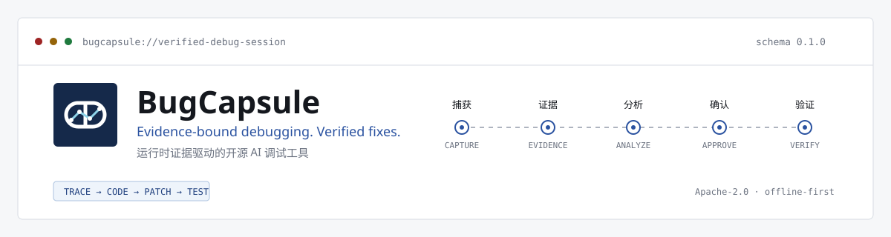
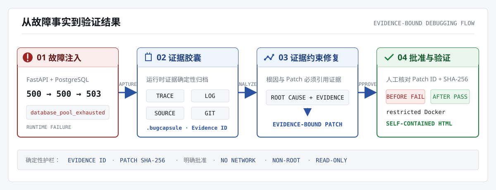

<p align="center"></p>

<p align="center"></p>

<h1 align="center">BugCapsule</h1>

<p align="center"><strong>Package one failure as portable, citable, and verifiable evidence.</strong></p>

<p align="center"><a href="README.md">中文</a> · <a href="https://gitee.com/lan0811/bug-capsule">Primary Gitee repository</a> · <a href="https://github.com/lanlan0811/BugCapsule">GitHub mirror</a> · <a href="docs/submission-evidence.md">Review evidence</a></p>

<p align="center"><code>0.1.0 in development</code> <code>Apache-2.0</code> <code>Python 3.10–3.12</code> <code>local-first</code> <code>no CDN</code></p>

## What BugCapsule is

BugCapsule is an open-source AI debugging tool built around runtime evidence and verified fixes. It organizes traces, logs, stack traces, source windows, Git state, root-cause candidates, patches, and regression results into an integrity-checked `.bugcapsule` archive. Every model claim must resolve to an `Evidence ID` from the current failure.

The project does not let a model edit the main workspace. It implements a constrained engineering loop:



The primary demo focuses on one reproducible failure: a FastAPI order service retains SQLAlchemy sessions on an exception path. A PostgreSQL pool fixed at two connections deterministically returns `HTTP 503 / database_pool_exhausted` on the third request.

## Technology stack

Every icon is a repository-local SVG. The README uses no CDN or remote badge service.

<table align="center">
  <tr>
    <td align="center"><br><sub>Python 3.10–3.12</sub></td>
    <td align="center"><br><sub>FastAPI</sub></td>
    <td align="center"><br><sub>PostgreSQL</sub></td>
    <td align="center"><br><sub>SQLAlchemy 2</sub></td>
    <td align="center"><br><sub>OpenTelemetry</sub></td>
  </tr>
  <tr>
    <td align="center"><br><sub>Docker Compose</sub></td>
    <td align="center"><br><sub>Pydantic</sub></td>
    <td align="center"><br><sub>Typer CLI</sub></td>
    <td align="center"><br><sub>Jinja2 + HTMX</sub></td>
    <td align="center"><br><sub>Open Capsule</sub></td>
  </tr>
</table>

## Deterministic guardrails

| Common AI-fix risk | BugCapsule control |
| --- | --- |
| A root cause cannot be traced back | Every candidate may cite only `Evidence ID`s included in its request |
| A model changes arbitrary files | Only canonical unified diffs pass allowed-root, protected-path, and source-evidence checks |
| Content changes after approval | Patch ID, full SHA-256, and explicit approval must all match |
| A Patch contaminates the workspace | It is applied only to a temporary after-copy; workspace hashes are compared |
| The model controls verification | Regression commands are project configuration, never model output |
| A network outage breaks the demo | `live`, `replay`, and `off` are explicit modes; replay is never presented as live inference |

## Ten-minute quick start

### Requirements

- Windows 10/11, Linux, or macOS;
- Python 3.10–3.12;
- [uv](https://docs.astral.sh/uv/);
- Docker Desktop or Docker Engine with Compose v2 for the primary demo and isolated verification.

### Install and diagnose

```powershell
Copy-Item .env.example .env
uv sync --frozen --group dev
uv run bugcapsule --version
uv run bugcapsule doctor
```

Configuration comes only from `.env` or `BUGCAPSULE_*` environment variables. `.env` is ignored by Git; [`.env.example`](.env.example) documents every field. `doctor` is read-only: it does not create directories, start containers, or print secret values.

### Start the local Web application

```powershell
uv run bugcapsule serve
```

Open `http://127.0.0.1:8765`. The health endpoint is `GET /healthz`; OpenAPI is available at `/api/docs`. The server binds to loopback by default.

### Run the PostgreSQL failure scenario

```powershell
uv run bugcapsule demo up
uv run bugcapsule demo run
uv run bugcapsule demo capture
uv run bugcapsule demo reset
uv run bugcapsule demo down
```

`demo run` asserts the fixed `500 → 500 → 503` sequence. `demo capture` safely copies redacted JSONL from the named volume, validates byte limits, syntax, and Trace IDs, then creates a capsule. The Web “sync and capture” action uses the same controller.

## From evidence to a verified fix

### Capture and inspect

```powershell
uv run bugcapsule capture --trace-id <32-character-trace-id>
uv run bugcapsule index rebuild
uv run bugcapsule capsules list --query demo-order-api
uv run bugcapsule capsules show <capsule-id>
```

Capsule files are authoritative. SQLite stores only a rebuildable metadata index. Import always revalidates the Schema, ZIP safety limits, and every member SHA-256.

### Analyze and propose a Patch

```powershell
uv run bugcapsule analyze <capsule-id> --mode replay
uv run bugcapsule patch generate <capsule-id> --mode replay
```

To enable an OpenAI-compatible live provider, configure `.env`:

```dotenv
BUGCAPSULE_MODEL_MODE=live
BUGCAPSULE_MODEL_API_STYLE=responses
BUGCAPSULE_MODEL_BASE_URL=https://api.openai.com/v1
BUGCAPSULE_MODEL_API_KEY=replace-with-your-key
BUGCAPSULE_MODEL_NAME=replace-with-model-name
```

The provider receives only redacted, prioritized evidence under a byte budget. Responses must satisfy a strict schema. An unknown evidence reference triggers one retry, then an explicit failure.

### Approve and verify in isolation

```powershell
uv run bugcapsule verify <capsule-id> `
  --patch-id <patch-id> `
  --approved-sha256 <full-64-character-sha256> `
  --approve

uv run bugcapsule report <capsule-id> --output .\verification-report.html
```

The verifier runs as non-root with no network, read-only mounts, `cap-drop=ALL`, `no-new-privileges`, and CPU, memory, PID, temporary-storage, and timeout limits. The report is self-contained: it loads no remote scripts, fonts, or images and remains reviewable offline.

## Open `.bugcapsule` format

`.bugcapsule` is a deterministic ZIP exchange format beginning at Schema `0.1.0`. It contains a manifest, trace/log/source evidence, a redaction report, and analysis, Patch, and verification artifacts when those stages have run. `manifest.json` records every member SHA-256, while Evidence IDs are derived from canonical content.

See the [Capsule Schema](docs/capsule-schema.md) for field-level rules, integrity checks, and compatibility policy. A [ready-to-import simulated capsule](examples/README.md) is committed for reviewers.

## Verified evidence

| Area | Reproducible fact |
| --- | --- |
| Automated tests | 195 local tests pass with 90.82% branch-aware coverage |
| Python support | GitHub CI passes on Python 3.10, 3.11, and 3.12 |
| Docker scenario | CI verifies HTTP readiness, `500/500/503`, the pool-exhaustion marker, and reset |
| Fix stability | Restricted containers show 20/20 failures before and 20/20 passes after |
| Simulated evaluation | 12/12 annotated replay cases; 100% Top-1, citation validity, and required-evidence coverage |
| Supply chain | Production SBOM: 48 components; 47 hash-locked dependencies audited; zero known vulnerabilities |
| Submission assets | Eight-page PDF, validated 180-second shot list, submission manifest, and gated Release workflow |

Annotated replay validates the deterministic pipeline and evaluator; it is not a claim about live-model capability. See the [competition evidence index](docs/submission-evidence.md) for exact commands and CI links.

## Security boundaries

- Authorization, cookies, tokens, connection strings, email addresses, phone numbers, and common key formats are redacted by default.
- Raw prompts, raw provider responses, and original secret values are not persisted.
- Import limits member count, per-file and total expanded size, compression ratio, paths, and member types.
- Patch parsing rejects traversal, binaries, deletion, rename, copy, mode changes, and protected-file edits.
- Verification never mounts the Docker socket, host credentials, user directories, or a writable main workspace.
- Report vulnerabilities privately according to [SECURITY.md](SECURITY.md), not in a public issue.

The complete asset list, trust boundaries, mitigations, and residual risks are documented in the [threat model](docs/threat-model.md).

## Repository map

```text
src/bugcapsule/          capsule, index, analysis, Patch, verification, and Web code
verification_tests/     read-only fixed regression and repair fixture
tests/                  unit, integration, contract, and security tests
docs/                   architecture, Schema, threat model, evaluation, and delivery docs
examples/               reviewable simulated capsule
output/                 PDF, video plan, usability, and submission assets
.design_library/        BugCapsule Design System
```

## Documentation

| Topic | Documents |
| --- | --- |
| System design | [Architecture](docs/architecture.md) · [Capsule Schema](docs/capsule-schema.md) · [Threat model](docs/threat-model.md) |
| Verification and evaluation | [Benchmark](docs/benchmark.md) · [Usability protocol](docs/usability-study.md) · [Roadmap](docs/roadmap.md) |
| Release and submission | [Supply chain](docs/supply-chain.md) · [Review evidence](docs/submission-evidence.md) · [Submission manifest](output/submission/README.md) |
| Demo assets | [Example capsule](examples/README.md) · [Recording runbook](docs/demo-runbook.md) · [Project PDF](output/pdf/README.md) |
| Community | [Commercial use and redistribution](LICENSING.md) · [Contributing](CONTRIBUTING.md) · [Security](SECURITY.md) · [Code of Conduct](CODE_OF_CONDUCT.md) · [Changelog](CHANGELOG.md) |

## Current status

BugCapsule remains a `0.1.0` development release. Linux Docker CI, governance, the PDF, and a reproducible demo plan are complete. The repository deliberately contains no placeholder claims for these required external results:

1. independent evaluation of the competition's selected live model;
2. an anonymized study with 3–5 first-time users;
3. three Windows Docker recording rehearsals and the final MP4;
4. a dual-platform `v0.1.0` Release after every gate is cleared.

## Contributing and license

Gitee is the primary repository and the issue/contribution entry point. GitHub is a synchronized mirror. Read [CONTRIBUTING.md](CONTRIBUTING.md) and run all quality gates before submitting changes.

Project copyright: Copyright © 2026 **lan0811 and BugCapsule contributors**. The original developer and maintainer is **lan0811**.

BugCapsule's original source code, documentation, and visual assets are licensed under the [Apache License 2.0](LICENSE). It permits commercial use, modification, and proprietary derivatives, while redistribution requires preservation of the license, change notices, and applicable attribution. Read the plain-language [commercial use and redistribution notice](LICENSING.md). Third-party copyrights and license terms are listed in [THIRD_PARTY_NOTICES](THIRD_PARTY_NOTICES) and [NOTICE](NOTICE).
